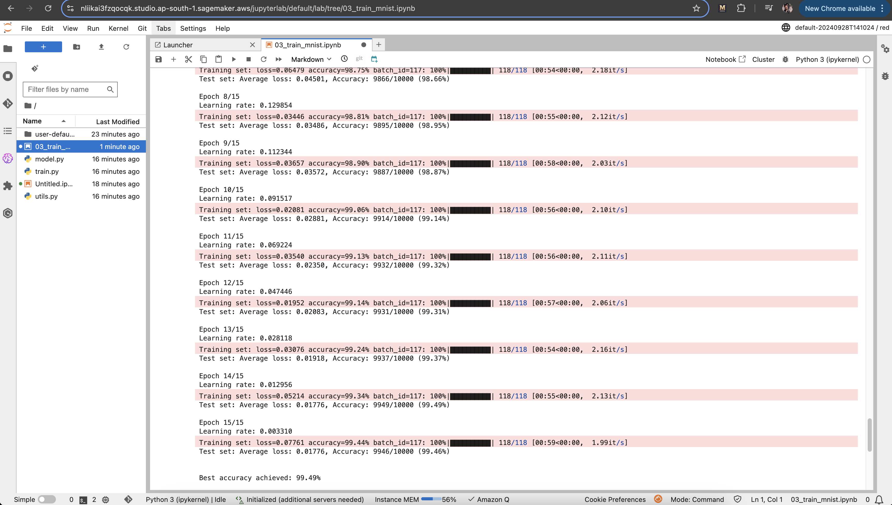

# MNIST Classification Experiments

This repository contains experiments for classifying the MNIST dataset using different neural network architectures. The experiments are conducted in three Jupyter notebooks: `01_train_mnist.ipynb`, `02_train_mnist.ipynb`, and `03_train_mnist.ipynb`. Each notebook explores a different model architecture and training strategy.

## Experiment 1: `Model1` in [01_train_mnist.ipynb](./01_train_mnist.ipynb)

### Summary
- **Architecture**: Model1 is a lightweight convolutional neural network with a total of 6,984 parameters.
- **Data Handling**: Utilizes the MNIST dataset with a custom wrapper for data augmentation.
- **Augmentation**: Basic normalization applied.
- **Training Configuration**:
  - Batch size: 512
  - Optimizer: SGD with momentum
  - Number of epochs: 15
- **Target Accuracy**: 99%+
- **Results**: Achieved a best test accuracy of 99.02%.

### Key Findings
- Fast convergence with >98% accuracy by epoch 4.
- Slight overfitting observed with training accuracy reaching 99.37%.
- Potential improvements include adding dropout and implementing learning rate scheduling.

---

## Experiment 2: `Model2` in [02_train_mnist.ipynb](./02_train_mnist.ipynb)

### Summary
- **Architecture**: `Model2` is a more complex architecture with 7,236 parameters.
- **Data Handling**: Same MNIST dataset with a custom wrapper.
- **Augmentation**: Basic normalization applied, no additional augmentations.
- **Training Configuration**:
  - Batch size: 512
  - Optimizer: SGD with momentum
  - OneCycleLR scheduler used for learning rate adjustment.
  - Number of epochs: 15
- **Target Accuracy**: 99.2%+
- **Results**: Achieved a best test accuracy of 99.39%.

### Key Findings
- Improved accuracy over `Model1` by 0.37%.
- Faster convergence and more stable training due to OneCycleLR.
- Better generalization with proper regularization techniques.

---

## Experiment 3: `Model3` in [03_train_mnist.ipynb](./03_train_mnist.ipynb)

### Summary
- **Architecture**: `Model3` builds on `Model2` with added dropout layers, maintaining a total of 7,236 parameters.
- **Data Handling**: MNIST dataset with a custom wrapper.
- **Augmentation**: Enhanced augmentation pipeline including `ShiftScaleRotate` transformation.
- **Training Configuration**:
  - Batch size: 512
  - Optimizer: SGD with momentum
  - OneCycleLR scheduler used for learning rate adjustment.
  - Dropout rate: 0.04
  - Number of epochs: 15
- **Target Accuracy**: 99.5%+
- **Results**: Achieved a best test accuracy of 99.53%.

### Key Findings
- Combined benefits of dropout and enhanced data augmentation led to improved performance.
- Minimal overfitting with training accuracy reaching 99.52%.
- Consistent performance and better generalization compared to previous models.

---

## Conclusion

The experiments demonstrate the effectiveness of different architectures and training strategies for MNIST classification. Each model builds upon the previous one, incorporating lessons learned to improve accuracy and generalization. Future work may explore additional augmentation techniques, different architectures, and advanced regularization methods.

## Screenshot for SageMaker

Training on SageMaker

